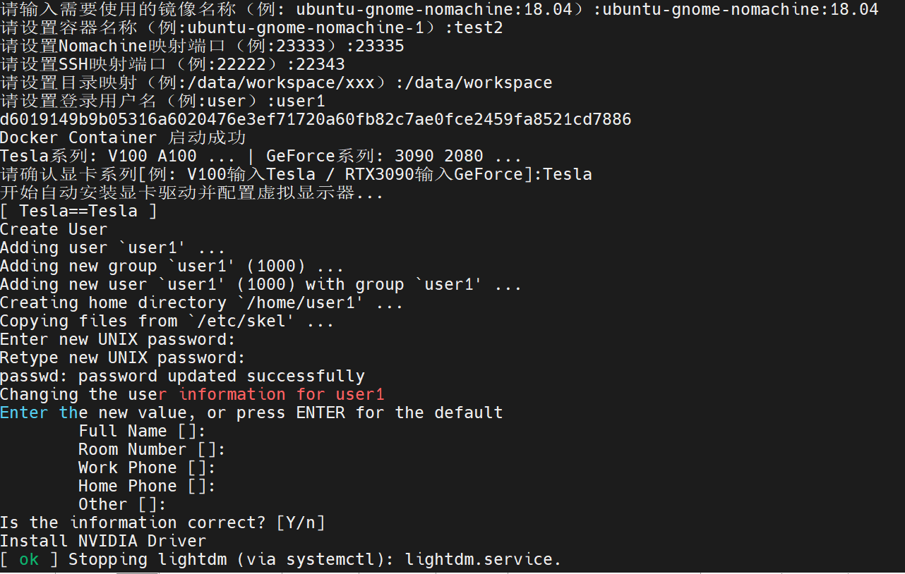

# Ubuntu 18.04 20.04 with Gnome [Nomachine Desktop]

## 参考资料Docker-GUI代码：
基于该仓库ubuntu系列代码去除对宿主机X11的依赖
https://github.com/fadams/docker-gui

## 参考资料Docker-Nvidia-Glx-Desktop:
参考该代码仓库对显卡驱动的安装部分
https://github.com/ehfd/docker-nvidia-glx-desktop  

## 相关仓库：
https://github.com/gezp/docker-ubuntu-desktop  

### 1. 简介
* 镜像目的：构建基于Docker的Ubuntu系统，支持原生桌面Gnome，同时安装程序的方式和宿主机尽量做到无区别  
* 该项目实现ubuntu18.04 20.04的远程连接桌面（Lightdm+Gnome+Nomachine），容器使用虚拟显示器DISPLAY=:0并支持OpenGL+Vulkan。  
* 项目根据上述两个仓库制作不依赖宿主机X服务的Gnome远程桌面，项目主要用于：远程办公/运行需要Opengl/Vulkan的程序（例如：Carla / UnrealEngine 4 等）

支持的镜像Tag  
* Ubuntu18.04: 18.04
* Ubuntu20.04: 20.04

Ubuntu18.04远程桌面示意图  


Ubuntu20.04远程桌面示意图  


### 2.基本使用（Ubuntu1 18.04 20.04 通用） 
* 简易教程-无需克隆仓库内容-必要脚本已拷贝至/home目录
#### 2.1 准备工作
* 必要环境：docker nVidia-docker nomachine  
* 备注：
* 1. 该镜像需要用到/home目录下的虚拟显示器配置脚本，将自动安装需要的驱动程序（支持Tesla/Geforce系列显卡自动安装）
* 2. docker容器内部安装宿主机版本一致的显卡驱动需要docker支持'--privileged=true'参数
#### 2.2 创建容器
* 关于Gpu Cpu渲染的说明
```bash
Gpu模式下会因为深度学习服务器显卡利用率过高导致渲染速度变慢，所以请根据个人情况考虑是否使用Gpu渲染 (默认识别宿主显卡渲染 例：V100)
Cpu模式下速度会有所提升，连接速度较快可以获得较好的可视化交互效果（默认使用llvmpipe）
```

* docker pull: 获取Ubuntu 18.04 或 20.04镜像
```bash
docker pull colorfulsky/ubuntu-gnome-nomachine:18.04  
                        or                  
docker pull colorfulsky/ubuntu-gnome-nomachine:20.04  
```

* docker run: 创建并运行容器  
```bash
方式1(脚本运行-推荐):  
wget https://raw.githubusercontent.com/ColorfulSS/docker-ubuntu-gnome-nomachine/master/2-remote-virtual-desktops/nx/ubuntu-18.04-gnome-nomachine/ubuntuSimple.sh  
# 如无法访问请使用如下链接  
wget https://git.ustc.edu.cn/Colorful/file_download/-/raw/main/ubuntuSimple.sh
# 增加可执行权限
chmod +x ubuntuSimple.sh
# 执行自动安装配置脚本 - 需要根据提示输入相关信息  
./ubuntuSimple.sh  
```


```bash
方式2(直接运行):   
# 自行设置如下参数  
# 需要使用的镜像名:         NomachineBindPort  
# 容器名称:                 CONTAINER  
# Nomachine连接端口:        NomachineBindPort   
# SSH连接端口:              SshBindPort  
# Ubuntu系统自定义用户名:   CreateUserAccount  
# 自定义映射目录:           WorkSpaceBind  
docker run -d \
    --restart=always \
    -p $NomachineBindPort:4000 \
    -p $SshBindPort:22 \
    --privileged=true\
    --userns host \
    --device=/dev/tty0 \
    --name $CONTAINER \
    --ipc=host \
    --shm-size 2g \
    --security-opt apparmor=unconfined \
    --cap-add=SYS_ADMIN --cap-add=SYS_BOOT \
    -e CreateUserAccount=$CreateUserAccount \ # 设置的用户名称
    -e RenderType=$RenderType \               # 使用的渲染模式 Gpu or Cpu
    -v /sys/fs/cgroup:/sys/fs/cgroup \
    -v $WorkSpaceBind:/data \
    $IMAGE /sbin/init  

# 根据显卡类型执行不同的指令  
# Tesla系列: V100 A100 ...   
docker exec -it $CONTAINER /home/Tesla-XorgDisplaySettingAuto.sh  
# GeForce系列: 3090 2080 ...  
docker exec -it $CONTAINER /home/GeForce-XorgDisplaySettingAuto.sh  

```
* docker exec: 进入容器执行虚拟显示器配置脚本(调试使用)  
```bash
# 容器名称: CONTAINER 进入root账户
docker exec -itd $CONTAINER bash  
```
#### 2.3 连接容器 
SSH连接 - 考虑到安全问题-未安装SSH [如有需求请自行安装 并配置登陆安全策略]  
```bash
#ssh访问容器
ssh username@host-ip -p xxxx  
```
Nomachine远程桌面连接
* 下载nomachine软件，ip为主机ip，端口为自定义端口，输入用户名+密码，进行连接即可
* 如需修改NX登陆策略为key认证: https://knowledgebase.nomachine.com/AR03Q01020


#### 2.4 Vulkan安装 (可选)
* 对于需要Vulkan支持的程序，运行安装脚本自动安装Vulkan程序（请自测支持情况）
* 1. 进入/home目录
* 2. 执行vulkan-ubuntu-18.04.sh 或 vulkan-ubuntu-20.04.sh脚本
* 3. 执行vulkaninfo测试安装情况
#### 2.5 Display分辨率设置（按需求设置）  
Nomachine连接Ubuntu系统后需要根据客户端自定义合适的显示分辨率，进入系统后搜索Display即可  
Ubuntu18.04 Dissplay分辨率设置    


Ubuntu20.04 Dissplay分辨率设置    


#### 2.6 连接速度优化
由于使用虚拟显示器，同时通过局域网络连接到虚拟显示器，因此需要分别对网络部分以及系统部分进行速度优化（该部分又用户自行设置合适的参数）  
##### 2.6.1 Ubuntu系统部分
主要内容：关闭Gnome动画特效  
```bash
命令：gsettings set org.gnome.desktop.interface enable-animations false  
```
##### 2.6.2 Nomachine部分
主要内容：通过设置硬件解码已经网络传输部分实现  
Nomachine连接速度提升
* 1. 软件设置：https://forums.nomachine.com/topic/recommended-settings-for-fast-local-lan-connections-only 
* 2. 客户端设置硬件加速：https://knowledgebase.nomachine.com/FR04N03097  

#### 2.7 中文语言支持问题 (Docker Container内运行)
参考连接：https://blog.csdn.net/weixin_39792252/article/details/80415550
中文语言支持脚本 -> 进入2-remote-virtual-desktops/nx/ubuntu-20.04-gnome-nomachine/language.sh 运行脚本
```bash
# 安装中文支持包language-pack-zh-hans：
sudo apt-get install language-pack-zh-hans
# 然后，修改/etc/environment（在文件的末尾追加）：
LANG="zh_CN.UTF-8"
LANGUAGE="zh_CN:zh:en_US:en"
# 再修改/var/lib/locales/supported.d/local(没有这个文件就新建，同样在末尾追加)：
en_US.UTF-8 UTF-8
zh_CN.UTF-8 UTF-8
zh_CN.GBK GBK
zh_CN GB2312
# 最后，执行命令：
sudo locale-gen
# 对于中文乱码是空格的情况，安装中文字体解决。
sudo apt-get install fonts-droid-fallback ttf-wqy-zenhei ttf-wqy-microhei fonts-arphic-ukai fonts-arphic-uming
```

### 3.本地镜像构建 （该部分与fadams/docker-gui项目一致）
* fadams/docker-gui项目: https://github.com/fadams/docker-gui  

* 该部分需要克隆本项目代码ColorfulSS/docker-ubuntu-gnome-nomachine，重新构建容器  

#### 3.1 Ubuntu 18.04
fadams/docker-gui项目对Ubuntu:18.04添加systemd及Dbus支持，使得dockers容器内部可以启动Gnome并实现Vgl支持，以下说明为原项目编译过程！
##### 3.1.1 编译Gnome支持
进入0-virtual-desktops/ubuntu-18.04-gnome执行如下命令  
命令：'docker build -t ubuntu-gnome:18.04 .'  
镜像名称：'ubuntu-gnome:18.04'  
##### 3.1.2 编译Vgl支持
进入1-3D-accelerated-virtual-desktops/ubuntu-18.04-gnome执行如下命令  
命令：'docker build -t ubuntu-gnome-vgl:18.04 .'   
镜像名称：'ubuntu-gnome-vgl:18.04'  
##### 3.1.3 编译Nomachine支持 
进入2-remote-virtual-desktopsubuntu-18.04-gnome-nomachine执行如下命令  
命令：'docker build -t ubuntu-gnome-nomachine:18.04 -f Dockerfile .'   
镜像名称：'ubuntu-gnome-nomachine:18.04'  

#### 3.2 Ubuntu 20.04
fadams/docker-gui项目对Ubuntu:18.04添加systemd及Dbus支持，使得dockers容器内部可以启动Gnome并实现Vgl支持，以下说明为原项目编译过程！
##### 3.2.1 编译Gnome支持
进入0-virtual-desktops/ubuntu-20.04-gnome执行如下命令  
命令：'docker build -t ubuntu-gnome:20.04 .'  
镜像名称：'ubuntu-gnome:20.04'  
##### 3.2.2 编译Vgl支持
进入1-3D-accelerated-virtual-desktops/ubuntu-20.04-gnome执行如下命令  
命令：'docker build -t ubuntu-gnome-vgl:20.04 .'   
镜像名称：'ubuntu-gnome-vgl:20.04'  
##### 3.2.3 编译Nomachine支持
进入2-remote-virtual-desktopsubuntu-20.04-gnome-nomachine执行如下命令  
命令：'docker build -t ubuntu-gnome-nomachine:20.04 -f Dockerfile .'   
镜像名称：'ubuntu-gnome-nomachine:20.04'  

#### 3.3 运行镜像
运行过程和2部分内容一致，请参考上述内容！ 同时项目制作中参考了三位大佬[https://github.com/fadams/] [https://github.com/ehfd] [https://github.com/gezp] 和若干教程指导，希望能够作为更好的远程办公和科研学习平台，制作镜像目的是实现和宿主机类似的dockers容器！感谢三位大佬的教程和指导！
